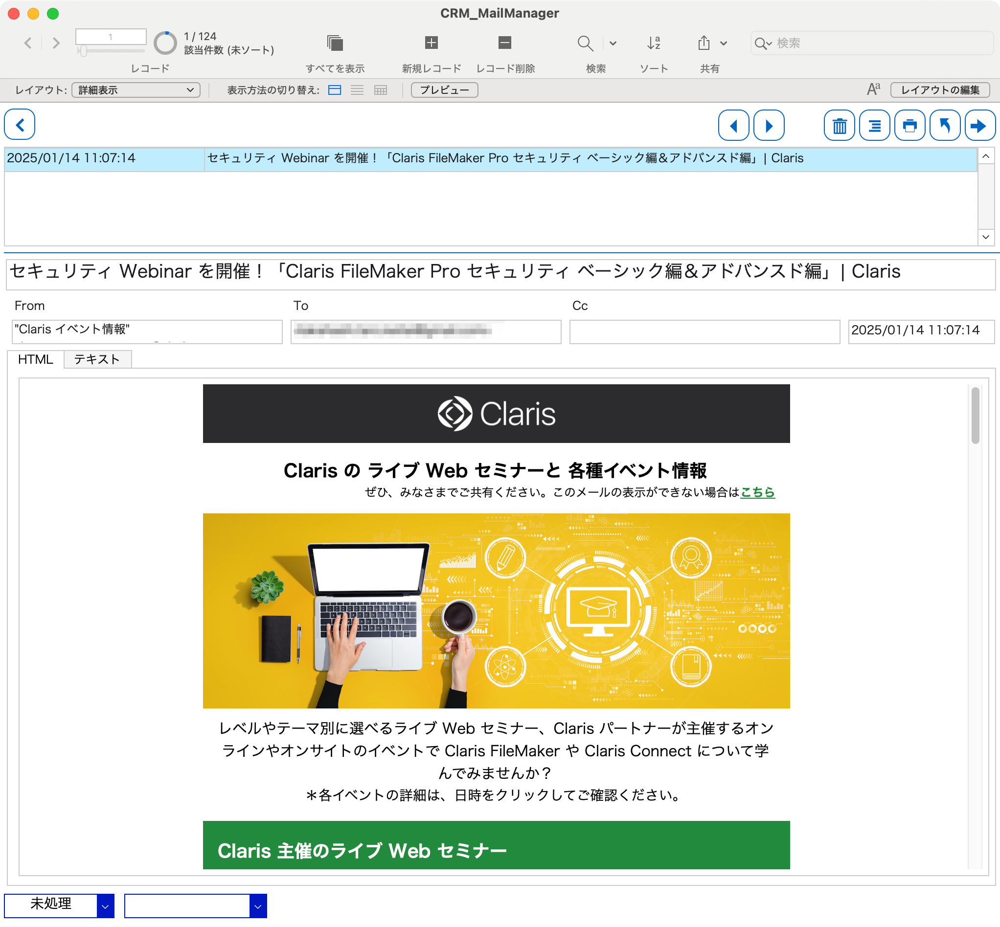

# CRMメールマネージャー

## 概要

CRMメールマネージャーは、営業や顧客対応のメールを複数人で共有するために開発された、FileMakerカスタムアプリです。メールの送受信や添付ファイルの管理、検索といった基本機能のほかに、ステータス管理や担当者の自動入力など、営業やカスタマーサポートの業務を効率化する機能を備えています。

メールボックス（ユーザーガイドより）


詳細表示（ユーザーガイドより）


ファイル構成は以下のとおりです。

```
.
├── CRM_MailManager.fmp12 # FileMakerカスタムアプリの本体
├── LICENSE               # ライセンスファイル
├── README.md             # このファイル
├── docs
│   ├── CRM_MailManager_System_Guide.pdf # システムガイド
│   └── CRM_MailManager_User_Guide.pdf   # ユーザーガイド
└── images
    ├── 001.png # 画面キャプチャ（メールボックス）
    └── 002.png # 画面キャプチャ（詳細表示）
```

## 使い方

導入方法は、システムガイドを参照してください。

一般的な使い方は、ユーザーガイドを参照してください。

## お問い合わせ

本アプリに関するお問い合わせは、[こちら](https://crm-mailmanager.netlify.app/)からお願いいたします。
